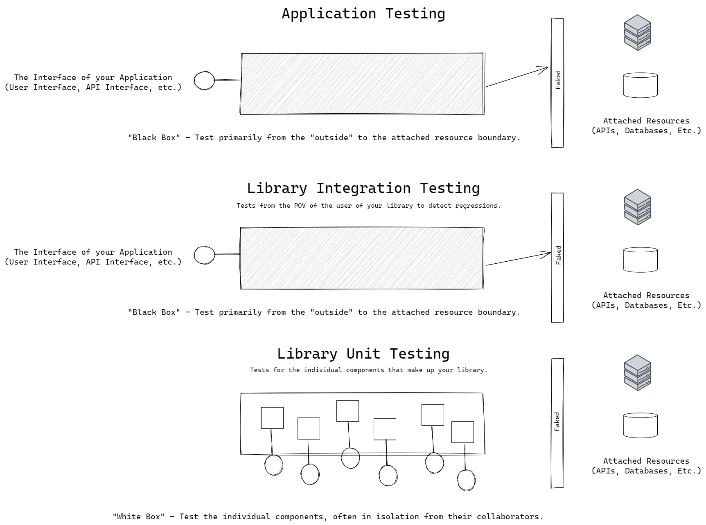

# Software Development Modalities

I think it is useful to differentiate the different _modes_[^1] we work in as developers. Most developers will, over their career, work in each of these modes. Most developers align themselves most closely with a specific mode of programming.

These are very **_broad_** categories, and are not meant to either draw hard-lines between the types of work we do, nor be exclusive to other types of programming you might encounter.

## Application Development

**DEFINITION**: Application developers _apply technological solutions to fulfill business requirements_.

"Applications" here means "applying" more than any "thing" that might come to mind when you think of an "application" (e.g. Microsoft Word, Minecraft, or a Mastodon client, for example.), though application developers were involved in the building of all those things.

Application developers work by responding to the needs of the business.

Since business _wins_ when we deliver _reliable_ software _quickly_, our job is largely balancing **_moving fast_**[^2] and **_balancing risk_**.

A thing that differentiates the code we write as application developers is that it is _specific_. When we are writing code that is in response to a business requirement, that has a specific use-case (and user!) in mind, we are working as application developers.

Some examples of code you might produce as an application developer might be:

- A user interface application written in the Swift programming language targeting the iOS operating system.
- An application that is delivered to a web browser that provides a user-interface for business analysts to monitor key metrics using a programming language like TypeScript using a framework like Angular.
- A "back end" service that exposes an HTTP interface that allows several applications to request pertinent data and request business operations to be performed.
- A "back end" service that works on a schedule to analyze terabytes of data to extract value using machine learning algorithms.
- A "back end" service that consumes a real-time stream of events and monitors for fraud detection.

## Library Development

**Definition**: Library developers build more _general purpose_ code that can be used across different applications (or other libraries).

The term "Library" here is meant to encompass everything from writing reusable _NuGet_ libraries shared amongst your team, across the company, or even open source, to creating _Frameworks_ that constrain applications to a set of best-practices for other applications built in that domain.

When you are working in the mode of _library_ development you are tackling issues that are more _general_ than a specific application. Often library programmers are creating libraries that _encapsulate_ some specialized behavior that needs to be _invariant_ (the same) across all applications that use that library. For example, certain business rules can be encapsulated in a library (like validations for data, etc.). Libraries are often created to encapsulate (e.g. "own") technical requirements, like security, logging, instrumentation, and compliance. Some libraries provide tools for developers, like development web servers.

Some examples of code you might produce as a library developer:

- An NPM package that provides common validation functions for data specific to our domain, written in JavaScript.
- A Nuget package that does time-zone calculations written in C#
- A container that handles specialized handling for the Kerberos authentication scheme implemented in the Go programming language.
- A command-line tool used by developers to manage database connection strings and other secrets in various environments written in C#

## Systems Programming

**Definition**: Systems Programmers create code that is usually more _general_ than even libraries. They are things like operating systems, database engines, networking protocols, container runtimes, and security monitoring infrastructure.

Examples of System Programming work might include:

- Creating a Kubernetes Operator that handles _egress_ connections to internal resources using the Go programming language.
- Creating a log aggregator for servers in production written using the Rust programming language.
- Creating a device driver for a custom GPU for doing machine learning work written in the C++ programming language.
- Creating embedded code for key-card entry devices for building security in the C programming language.

# Software Development Modalities and Business Value

Of the three "level", from _Application Development_, _Library Development_ and _Systems Programming_, it is somewhat obvious that application development is considered the priority in a corporate IT world. It is, after all, the applications developers that put the code that reflects the business needs in front of our users, and therefore creates new ways to increase revenue and decrease risk and liability.

Corporate IT gets the _most value_ from in-house developers that are working as application developers. Since your job will be as a _translator_ of the _business_ and it's particular way of doing things to the world of electrons, you will need to be well versed in both your programming chops as well as your knowledge of your particular sub-domain within the business.

Application development is the most _specific_ type of development in terms of mapping to what the business actually does and needs.

Application development tends to have a higher rate of _churn_[^3] than the other modes of development. When on a team that is working as a well-oiled machine doing CI/CD[^4], you may be pushing out new features (and 'retiring' others) several times a day.

> Our value to the business as application developers is directly correlated to our ability to translate their "world" to the world of code as quickly as possible, with the minimum of risk.

Software development is hard. It is also expensive. As in-house corporate software developers, our value is providing code that is very specific to the needs of the business. Some software is general purpose enough that it can be used across business domains. For example, there is little need for most businesses to have their own "special" brand of in-house word processor or email client.

In a similar way, justification for library or framework development is a harder sell because it is more _detached_ from the business-facing specific needs of the company. Since libraries or frameworks are _less_ specific than the applications we build, it is often most economical to bring in 3rd party libraries or frameworks (either commercial or open source) and either use them directly or extend them for our use.

Systems level programming is even a harder sell, and usually much less needed. Business and technical requirements most often can be fulfilled with existing operating systems, databases, and network protocols, for example. They are more _general_ purpose, by design.

An additional perspective is that library and systems level code have added expense in terms of two things:

1. Cost of maintaining. Once you create a library that many projects are using, things like version management, and keeping the library up to date with new versions of your programming environment are costly.
2. Libraries _often_ require a monolithic tech stack. Most libraries are creating for specific programming environment. You cannot use a NodeJS library in a C# application, or vice-versa. Things like multi-container pods as "sidecars" or other patterns in Kubernetes can help with this.

Libraries and Frameworks[^5] are usually best if they are _extracted_ from proven solutions, instead of created from speculation on what _might_ be needed (sometimes jokingly referred to as ["Architecture Astronautics"](https://www.joelonsoftware.com/2001/04/21/dont-let-architecture-astronauts-scare-you/)

# Software Development Modalities and Testing

It is either impossible or very unlikely (depending on who you ask) that _any_ code you create can be 100% free of defects. Even with _tons_ of testing, there is always an opportunity for bugs to emerge.

In other words, give up on the idea that you can write enough tests that your code will be _perfect_.

A problem with tests, especially if taken too far, is they are _also_ code, and not only do they need maintained, they can also **slow down your ability to be responsive to the business**, especially as an application developer. If you have a story card with what _appears_ to be a fairly trivial requirement change, but you have to assign tons of additional points to it because "we'll need to update all the tests", that is a problem.

There are lots of different variables that can go into any equation that you use to decide how many tests you should write.

- How likely is my implementation to fail? (Speculation)
- How _costly_ would it be if my implementation failed?
  - e.g. the difference between writing code for, say, a game vs. a flight control system for an aircraft.
- How _easy_ is it for me to _detect_ and _fix_ failures rapidly?

And on and on. It boils down to your confidence level - "If I deploy this software right now, how much confidence do I have that my reputation as a software developer will not be called into question?"

As application developers, we emphasize the tests that prove the _external quality_ of the code, primarily. The external quality is almost always directly related to the business requirements.

- Does it do the "right thing". (Does it meet my understanding of the business requirement)
- Does it do the this consistently with the overall vibe or "user experience" of the rest of the application?
- Does it meet other _technical_ requirements like:
  - Performance
  - Security
  - Compliance (regulatory, accessibility, etc.)

As application developers we have a leg up on testing. Since the very definition of "application developer" says that we are making _specific_ things for our customers, we can limit the scope of our tests to just those _specific_ things that are exposed through the interface of our application.

For example, if your application accepts some data like a Vehicle Identification Number (VIN), and the UI _disallows_ invalid entries from the user, there is no reason to test speculative things like "What if my application somehow got a bad VIN and tried to make an API call with it?".

If the API you are creating disallows `null` values in a request, there is little to no reason to check for - or test - how your code would behave _beyond_ that when presented with the impossible state of a `null` value.

For this reason, we emphasize (again, as application developers), testing our applications from the level of the _interface_. We write the lion's share of our tests to _simulate_ the expected and _possible_ interactions from the user driving our application.

The **_Entire Point of an Interface_** is to _limit_ the set of possible interactions that are possible with our code. So, design your user interfaces in a way that disallows users from creating invalid entries. Create the interfaces for your services in the same way. Set up invariant "gate keepers" that keep bad requests from getting through the guard at the door.

This will make most of your lower-level "unit" tests redundant. While in a code review a sleepy teammate may idly perk up to ask you "do you have a test that proves that method can handle a null value for that argument?" it is perfectly reasonable for you to say "Can you give me an example how, when this code is running, that could ever happen?".

Now beyond application development, when we dip into library or framework development, the rules change. Because these modalities are more _general_ we can't make safe assumptions always about how the libraries or systems might be used by others.

The low-level testing requirements for a _general purpose_ UI library, for example, has to be more intense, more _paranoid_ than your own application code. Let's say you are writing a validation library that will return whether a Vehicle Identification Number appears to be valid, and the make and model of the car represented by that VIN. This is something you've _extracted_ from your own code in your application, but now want to share with your teammates for other projects. It is not reasonable for you to assume that they would always call your function with a non-null value, for example. You would have to accommodate that, and have tests those show how your library should respond in that case.

Libraries, and even more, systems-level code tend to require way more testing against the internal implementation of the code. Unit tests.

Another reason for this is the versioning and compatibility requirements. Your tests will form a sort of _specification_ for how your library works at any given release (a point in time). If you are developing a new version, your tests should fail if they indicate that a _regression_ from previous behavior was detected. In other words, if a user of this library upgrades to your new version, will their stuff keep working, or do you need to warn them about some things?

Systems level programming will be even _more_ extreme in terms of testing. You might have multiple releases of your application per version (different operating systems, different processor architectures, etc.). This is costly, and why developers of products like MongoDB (a document database) or operating systems don't practice continuos deployment.

# Software Development Modalities and Languages

Most programming languages in common use today are "general purpose" programming languages. Each has it's strengths and weaknesses. More importantly, perhaps, each has a specific realm or target where the code can be run.

For example, languages like TypeScript can only execute on a platform that understands JavaScript (like a web browser, or NodeJS) because TypeScript compiles _to_ JavaScript.

Code written for iOS can only run on iOS devices (and often only certain _versions_ of those devices), and likewise, Android applications have similar (though slightly less restrictive) requirements.

Some languages have a runtime requirement. For example (modern) .NET and Java can run on about any operating system that has a runtime for those applications (the Common Language Runtime for .NET, and the Java Virtual Machine for Java). This is great, because the _same compiled code_ can run on a wider variety of operating systems, or versions of operating systems and even different processor architectures.

.NET used to (and still does, for legacy reason), have a runtime that will _only_ run on the Windows operating system. In 2016 Microsoft began creating a _cross platform_ runtime for a subset of the functionality called .NET Core. Writing .NET applications that are _not_ cross-platform (e.g. Windows only) is still supported for legacy reasons, and, frankly, for reasons having to do with some applications really only make sense _on windows_.

This sort of "cross platform" coding thing has lots of advantages, for sure, but also some limitations. The ability to write code like this means that the underlying hardware is, by necessity, _abstracted_ away from you as a developer. You won't likely be writing device drivers in Python, .NET, or Java for example. A benefit of this is that some of the technical things about writing and running code are _also_ abstracted away from us, like memory management. This category of language and environments usually use techniques like _garbage collection_ to _automatically_ manage your memory for you, largely preventing things like memory leaks or de-referenced pointers being used in naughty ways.

So the power to write something like a web application in TypeScript that will run on just about _any_ web browser, or a .NET service that can run on Windows, or a Mac, or Linux, gives me a lot of flexibility and feels slightly more aligned with the job of an _application_ developer than say, writing low-level code like C or assembler.

As I mentioned before, libraries tend to be coupled to a specific programming environment. I can't (easily) use a library written in say, the Rust programming language from my .NET code. Or vice-versa.

Another area this sort of falls apart is when you _need_ low-level access to the underlying operating system. Performance is sometimes a challenge using these higher-level languages as well.

There are times when using a lower-level language like Go, Rust, or C++ is a good choice.

It turns out the "cross-platform" neutrality isn't such a big deal in many cases as we thought. For example, most of the code I write (server side, anyhow) runs in containers. Those containers are _always_ Linux based. (either just the kernel, or a skinny distribution of linux). It might be helpful that I can write the code, run the code, debug the code, on my "preferred" operating system, which may be different than where it ultimately runs in production, and languages like Java, Python, and .NET allow you to do this, I find I increasingly write my code on Linux (either directly on a Linux development machine, or, increasingly, on Windows using the Windows Subsystem for Linux).

Running applications in containers and doing some version of service-oriented architecture (up to Microservices) means I can more frequently use the "best tool for the job". Some of my services are written in .NET, some of the stuff I do that digs deep into Kafka, for example, I use Java, and others use Go and Rust.

Languages like C++, Go, and Rust are compiled _specifically_ for an operating system and processor architecture. They can be used to write software that will run on most modern operating systems and processor architectures, but the actually _deployed_ code is statically compiled for the target operating system.

Those three languages (C++, Go, Rust), to varying degrees, give you great _power_, but that, as we know, means _great responsibility_. You have to understand more about memory and memory layout, manage a lot of lower-level "technical" stuff than you do in higher-level languages.

As application developers, what that means is our _brain share_[^5] is more split between business requirements and _technical requirements_. They are great tools to have on your shelf, for sure, especially if you are doing library programming and _definitely_ if you are doing systems programming. But they still aren't my "go to" for _application development_.

That isn't the _only_ consideration in choosing your language or platform, though. Obviously some things are dictated - you have to know some JavaScript if you are going to program in web browsers. Even with the advent of WASM[^6], you have to know the JavaScript APIs and the "vibe" of the browser.

In the mode of _application developer_ other considerations are how the tools and the _inner loop_ developer experience help keep me close to the business requirements, especially in terms of things like a type system. Type systems are our way of making invalid code impossible. You can't store a C# `int` in a C# `string` variable.

The more expressive the type system is, the more reliable I find my application code. This is often correlated with the number of lower-level tests I _don't_ have to write. When I was writing "raw" JavaScript I had _way_ more unit tests than I do now that most of my JavaScript is first run through the gauntlet of the TypeScript compiler, for example.

The reason I mention all of this is the choice of your language and platform has a direct connection to your testing strategy. C++ code needs _lots_ of low level tests. Rust needs some, but less than C++ because of it's fantastic type system. There is a lot to consider.

[^1]: All I mean here is something like if you are cooking dinner for your family or some friends, you might be in the "mode" of cooking, and then in the mode of "dishwasher", or in the mode of "dancing". Each of these modes are valid, and can be overlapped in a way that will have some impact on your effectiveness in one mode or the other.
[^2]: Moving fast. In many cases there is _tremendous_ business value in "moving to production" quickly. To be the first business that offers a new feature can be a key differentiator. The cost of moving fast is often **technical debt**. Some of the code you put into production may need to be rewritten once submitted to the harsh "real world". One technique we use, among many, to mitigate technical debt is _continuos integration and delivery_ and using _hypothesis driven development_. You and your team, along with the business, will explore ways to _verify_ that a big new feature is moving the business in the right direction by "testing the waters" and soliciting and gathering user feedback.
[^3]:
    Churn is a term that is used as a sort of metric related to "rate of change" of something. For example, a C++ library that provides functions for a game engine's physics may, after some time, have a low rate of "churn". We've pretty much got Newtonian physics down. However, an area that typically has a tremendous rate of churn in user interface design. Everything from stylistic choices, "branding", evolving accessibility requirements, and feedback from instrumentation in our applications on how the users are faring with the complexity of our application means there is a lot of frequent change. While there might be an objectively "best" way to calculate the arc of an artillery shell, or to validate a vehicle identification number, user interface is more subjective and susceptible to change. In other words, we have no idea, often, what we are doing. I've worked on many user interface applications where we couldn't decide _which_ approach to take with a certain design. Many times, we just tried both. See which one the users respond better to. Find a way to make it at least more statistically objective. (this is often called "A/B" testing) Sometimes entire systems are created with "mirror universes" to check the validity of one choice (or version) over another. This is sometimes called a "blue-green" deployment.
    [^4]: CI/CD - An acronym for either "Continuos Integrator and Continuous Deployment" _or_ "Continuos Integration and Continuos Delivery". In either case, it is a system and a process where applications, using automation, have their changes "continuously" built, tested, and merged into a shared repository (that's the integration part.) The difference between the "D's" in the second part (Delivery/Deployment) are the difference between when a in integration is successful, the artifact of the build process is _delivered_ to a shared repository (like a package repository, or Github release) where it can be handled by a team that does _release management_ before it goes into production. In a continuos delivery environment, as developers, we do our best to ensure that the code we create _could_ be put into production, but it is ultimately up to the release manager to decide _when_ it is put into production. With the continuos _deployment_ style, code changes from the developers, once successfully integrated, are automatically deployed to the production environment.

[^5]: Brain Share - what I mean by this is that my _mental_ powers are finite. I can only hold so much in my head at the same time. As I get older, this is even more noticeable (although I think it was mostly youthful arrogance that kept me from noticing it before). When I am working as an _application_ developer, I want as many resources as I have directed towards the _business requirements_. If I have to start keeping track of pointers, and what I've borrowed from the borrow checker while I'm figuring out how to correctly calculate a shipping date for a product being sent to another country, I get overwhelmed.
[^6]: WASM - Web Assembly. A format for lower-level code to run in runtimes like web browsers. Many languages can compile to WASM code.
